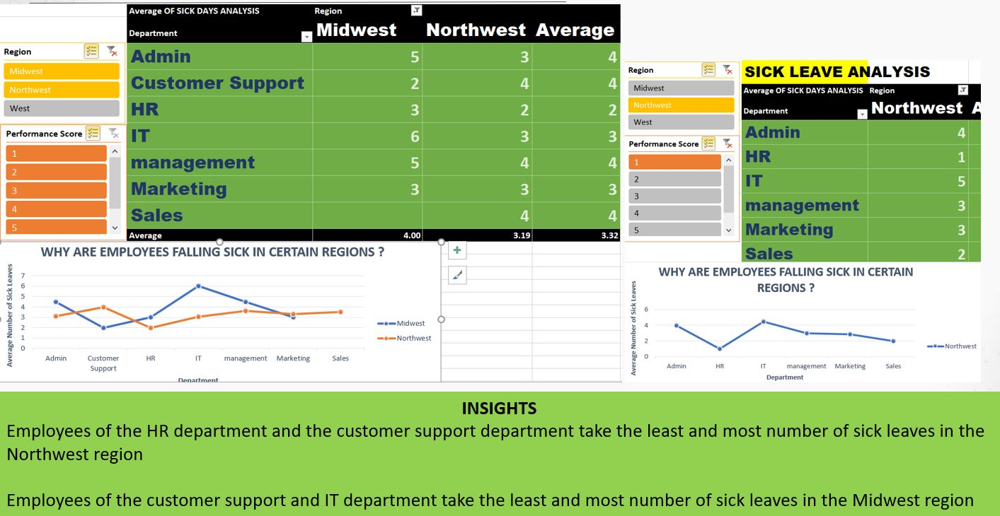

# KOUSHALYA-TRAINING-LEARNINGS
# CONSOLIDATED EXERCISE-LOCATED IN FOLDER PythonVisualizations
## Highlights !- Qucik way to convert dataframe fields to numeric format
```
df_SPX[['Open','High','Low','Price']]=df_SPX[['Open','High','Low','Price']].apply(lambda x:pd.to_numeric(x.replace('\,','',regex=True)))
```
# Image Complimenting the Python codes
## Scatterplot with color map showing perfomance of stocks in 2016-2017

```
<b><i>Sprint 1- Training on excel</b></i>
```

# Adding images related to Earlier sprint on Excel- HR Dataset Challenge
## REGION WISE SICK LEAVE ANALYSIS

## RANKING

## RELATION BETWEEN SICK LEAVE AND OVERTIME


